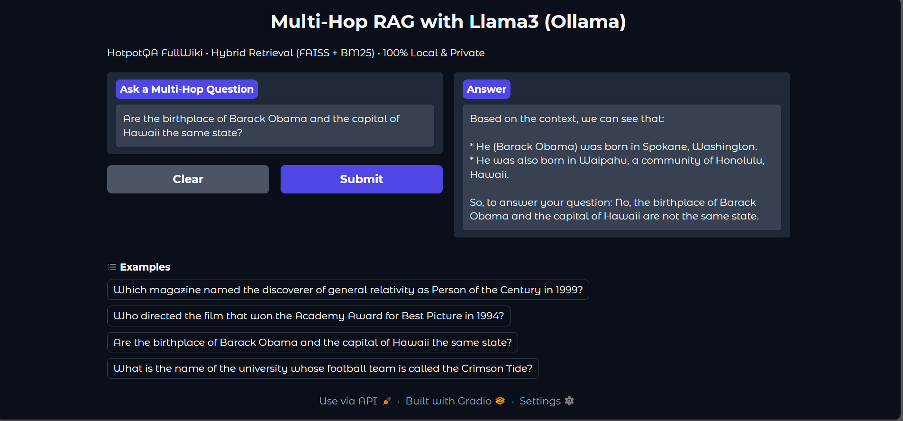
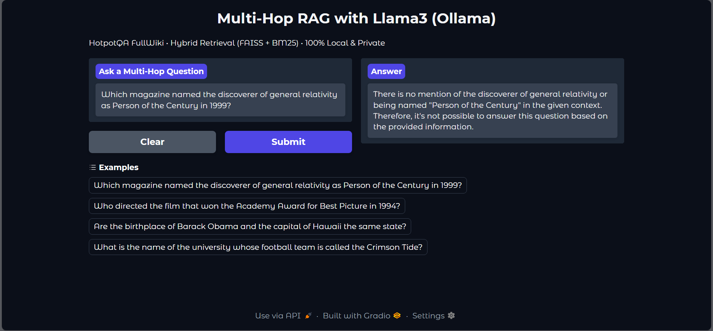
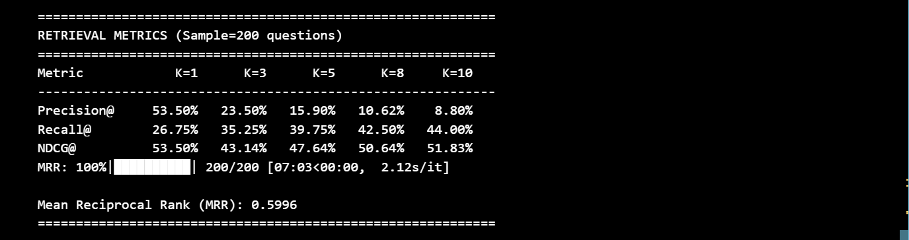

# Multi-Hop RAG System

A fully functional Multi-Hop Retrieval-Augmented Generation (RAG) system capable of answering complex questions that require reasoning over multiple documents.

## 📸 Screenshots

### Example Query


### Example Query


### Retrieval Results


[](https://www.python.org/downloads/)
[](https://opensource.org/licenses/MIT)

## 🌟 Features

- **Multi-Hop Reasoning**: Answers complex questions requiring evidence from multiple documents
- **Hybrid Retrieval**: Combines FAISS dense retrieval with BM25 sparse retrieval for maximum coverage
- **Question Decomposition**: Automatically breaks down complex queries into simpler sub-questions
- **LLM-Powered**: Uses Llama3.1:8b via Ollama for reasoning and answer generation
- **Interactive UI**: Built-in Gradio interface for easy interaction
- **Evaluated on HotpotQA**: Tested on the standard multi-hop QA benchmark

## 📊 Performance

Evaluated on 200 samples from HotpotQA fullwiki validation set:

| Metric | K=1 | K=3 | K=5 | K=8 | K=10 |
|--------|-----|-----|-----|-----|------|
| **Precision@K** | 53.50% | 23.50% | 15.90% | 10.62% | 8.80% |
| **Recall@K** | 26.75% | 35.25% | 39.75% | 42.50% | 44.00% |
| **NDCG@K** | 53.50% | 43.14% | 47.64% | 50.64% | 51.83% |

**Mean Reciprocal Rank (MRR)**: 0.5996

## 🏗️ Architecture
```
User Question
      ↓
Query Decomposition (Llama3.1:8b → 2–3 sub-questions)
      ↓
For each sub-question:
   → Dense Retrieval (FAISS)
   → Sparse Retrieval (BM25)
   → Merge + Deduplicate
      ↓
Combined Context (up to 32k tokens)
      ↓
Final Answer Generation (Llama3.1:8b)
      ↓
Gradio UI Output
```

## 🚀 Quick Start

### Prerequisites

- Python 3.8+
- Ollama installed and running
- Llama3.1:8b model pulled in Ollama

### Installation

1. **Clone the repository**
```bash
git clone https://github.com/apurvak3/multi_hop_rag.git
cd rag2
```

2. **Install dependencies**
```bash
pip install -r requirements.txt
```

3. **Install and setup Ollama**
```bash
# Install Ollama (if not already installed)
curl -fsSL https://ollama.com/install.sh | sh

# Pull Llama3.1:8b model
ollama pull llama3.1:8b
```

4. **Download HotpotQA dataset**
```bash
python download_dataset.py
```

### Running the System

1. **Start the Gradio interface**
```bash
python rag.py
```

2. **Access the UI**
Open your browser and navigate to `http://localhost:7860`

3. **Ask a question**
Example: "Who is the director of the film that featured the character named Dastan?"

## 📁 Project Structure
```
multi_hop_rag/
├── rag.py                 # Main RAG system implementation
├── requirements.txt       # Python dependencies
├── README.md             # This file

```

## 🔧 Configuration

Key parameters can be adjusted in `rag.py`:
```python
# Retrieval settings
TOP_K_DENSE = 5          # Number of documents from dense retrieval
TOP_K_SPARSE = 5         # Number of documents from sparse retrieval
MAX_CONTEXT_TOKENS = 32000  # Maximum context window

# Model settings
MODEL_NAME = "llama3.1:8b"
EMBEDDING_MODEL = "all-MiniLM-L6-v2"
```

## 🧪 Evaluation

Run evaluation on HotpotQA validation set:
```bash
python evaluation.py --sample-size 200
```

This will compute:
- Precision@K
- Recall@K
- NDCG@K
- Mean Reciprocal Rank (MRR)

## 📚 Retrieval Strategies

### Implemented Approaches

1. **Dense Retrieval (FAISS)**
   - Uses sentence-transformer embeddings
   - Captures semantic similarity

2. **Sparse Retrieval (BM25)**
   - Token-based lexical matching
   - Strong for keyword-heavy queries

3. **Hybrid Retrieval**
   - Combines dense + sparse for best coverage
   - Deduplicates and merges results

4. **Question Decomposition**
   - Breaks complex queries into 2-3 sub-questions
   - Improves retrieval precision

## 🛠️ Technical Stack

- **Embeddings**: sentence-transformers (all-MiniLM-L6-v2)
- **Dense Index**: FAISS
- **Sparse Retrieval**: BM25 (rank-bm25)
- **LLM**: Llama3.1:8b via Ollama
- **UI**: Gradio
- **Dataset**: HotpotQA (fullwiki)

## 📖 Usage Examples

### Example 1: Bridge Question
```
Q: "Who is older, Annie Morton or Terry Richardson?"
A: "Terry Richardson is older. Annie Morton was born in 1970, 
    while Terry Richardson was born in 1965."
```

### Example 2: Comparison Question
```
Q: "Which film was released first, Kistimaat or Journey 2: The Mysterious Island?"
A: "Journey 2: The Mysterious Island was released first in 2012, 
    while Kistimaat was released in 2014."
```

## 🤝 Contributing

Contributions are welcome! Please feel free to submit a Pull Request. For major changes:

1. Fork the repository
2. Create your feature branch (`git checkout -b feature/AmazingFeature`)
3. Commit your changes (`git commit -m 'Add some AmazingFeature'`)
4. Push to the branch (`git push origin feature/AmazingFeature`)
5. Open a Pull Request

## 📝 Citation

If you use this code in your research, please cite:
```bibtex
@misc{multi_hop_rag_2024,
  author = {Apurva},
  title = {Multi-Hop Retrieval-Augmented Generation System},
  year = {2024},
  publisher = {GitHub},
  url = {https://github.com/apurvak3/multi_hop_rag}
}
```

## 📄 License

This project is licensed under the MIT License - see the [LICENSE](LICENSE) file for details.

## 🙏 Acknowledgments

- HotpotQA dataset creators
- Sentence Transformers library
- Ollama team
- FAISS and BM25 implementations

## 📧 Contact

**Apurva** - [@apurvak3](https://github.com/apurvak3)

Project Link: [https://github.com/apurvak3/multi_hop_rag](https://github.com/apurvak3/multi_hop_rag)

---

⭐ If you find this project helpful, please consider giving it a star!